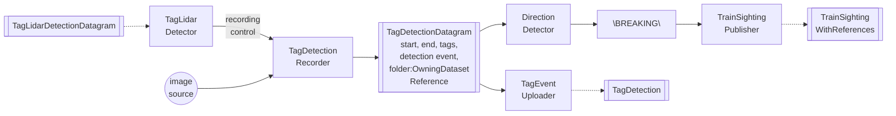
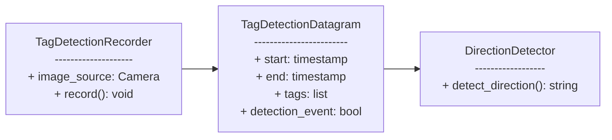

## Checklist
- [ ] Good Morning - koupelna, fyz. příprava, snídaně
- [ ] Warmup - tasks, calendar, mail, setup
- [ ] 10-20 min anki
- [ ] 2 [leet code](https://docs.google.com/spreadsheets/d/1lu5U-ZDVBZpZVJiNJjaZ3I12ar7Ko79Gesmt5Jp-soM/edit?gid=620493329#gid=620493329)
- [ ] refactor 3 notes
- [ ] Add at least one person to the People folder **PROJECTS/iC/wiki/General/People**

```
gcloud compute instances stop ai-teacher-1 --zone=us-central1-c
gcloud compute instances set-machine-type ai-teacher-1 --zone=us-central1-c --machine-type=e2-medium
gcloud compute instances start ai-teacher-1 --zone=us-central1-c
```


```
docker run --name memsnap -e USER_GID=${USER_GID} -e SECRET_KEY=${SECRET_KEY:-$(openssl rand -hex 24)} -u "appuser:${USER_GID}" -p 80:8000 -v /var/run/gunicorn:/var/run/gunicorn -v /var/log/gunicorn:/var/log/gunicorn -v /var/log/memsnap:/var/log/memsnap -v /var/run/memsnap:/var/run/memsnap memsnap:${TAG:-latest} gunicorn 'wsgi:app'


      - FLASK_DEBUG=1  # Enable debug mode
```


RS:
projit si car separator a kouknout na training
otestovat jestli funguje rate ls car features
zamyslet se jak implementovat direction
ai-teacher


SMTP server smtp-relay.brevo.com
Port 587
Login 8a6bae001@smtp-brevo.com
Password TAxqDNhcKFW0Sr16


k.naiserova@gmail.com
filip.naiser@gmail.com
tonyack@gmail.com
josefpechanec@gmail.com

sejvls@seznam.cz
saranai@seznam.cz


bin/tag_reader_sensor_manager.py
cv_pipeline/tag_reader/tag_detection_recorder.py
cv_pipeline/tag_reader/tag_detection_uploader.py
cv_pipeline/tag_reader/tag_lidar_detector.py
cv_pipeline/tag_reader/train_direction_detector.py





```
# tohle funguje, jsem authenticated
docker run --rm -it -v ~/.config/gcloud:/root/.config/gcloud deleteme bash


export GOOGLE_APPLICATION_CREDENTIALS="/tmp/credentials.json"
export ACCOUNT="1000668196687-compute@developer.gserviceaccount.com"

gcloud iam service-accounts keys create "${GOOGLE_APPLICATION_CREDENTIALS}" --iam-account="${ACCOUNT}"

gcloud auth activate-service-account "${ACCOUNT}" --key-file="${GOOGLE_APPLICATION_CREDENTIALS}"
```
