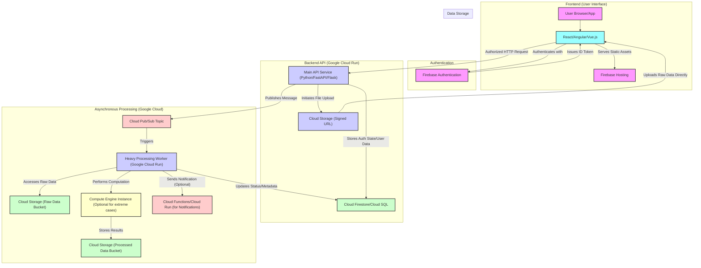

### spustit cv pipeline na 211

uninstalled `sensor-manager` package
```bash
export GOOGLE_APPLICATION_CREDENTIALS="/data/keys/service_account.json"
PROMETHEUS_MULTIPROC_DIR="$(mktemp -d)" CLOUDPATHLIB_FILE_CACHE_MODE=cloudpath_object /data/git/cv_pipeline/bin/sensor_manager.py --mqtt-config /data/configs/sensor-manager/mqtt_options.json /data/configs/sensor-manager/sensor_manager_config.json
```

pro pripad ze uninstall `sensor-manager` odstrani `sensor_manager.service` file:
```bash

[Unit]
Description=Sensor_Manager
After=network.target

[Service]
Environment=GOOGLE_APPLICATION_CREDENTIALS=/data/keys/service_account.json
Type=simple
Restart=always
User=rs-ops
ExecStart=/bin/bash -c 'PROMETHEUS_MULTIPROC_DIR="$(mktemp -d)" CLOUDPATHLIB_FILE_CACHE_MODE=cloudpath_object /usr/bin/sensor_manager.py --mqtt-config /data/configs/sensor-manager/mqtt_options.json /data/configs/sensor-manager/sensor_manager_config.json'

[Install]
WantedBy=network-online.target
```

#TODO: pak znovu nainstalluj `sensor-manager`





